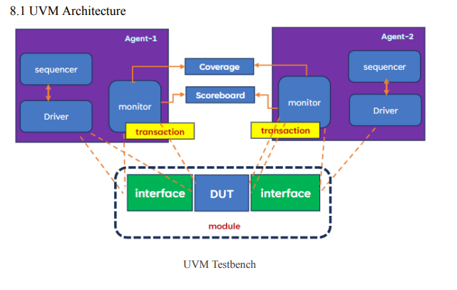
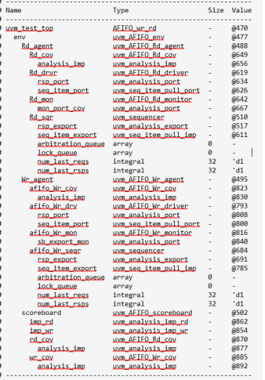

# Asyc_FIFO
## Top Level Block Diagram

## Overview
This FIFO (First-In-First-Out) design is a fully parameterized and synchronous module that supports independent clock domains for Read and Write ports. It is designed to be highly configurable while being limited only by the simulator and hardware constraints.

## Features
- **Configurable Data Width**: Supports data widths up to \([2^{64} - 1]\) bits, parameterized by `DATASIZE`.
- **Configurable Memory Depth**: Supports memory depths up to \([2^{64} - 1]\) locations, parameterized by `DEPTH`.
- **Fully Synchronous**: Ensures reliable operation with independent clock domains for Read and Write ports.
- **Status Flags**:
  - `FULL` flag to indicate when the FIFO is full.
  - `EMPTY` flag to indicate when the FIFO is empty.
- **Optional Output Signals**:
  - `Write-Full` signal to indicate when the write port is full.
  - `Read-Empty` signal to indicate when the read port is empty.

## UVM Testbench

The UVM (Universal Verification Methodology) testbench for this Asynchronous FIFO is designed to thoroughly verify the functionality, performance, and reliability of the design.

### UVM Architecture

The testbench follows a standard UVM architecture as shown below:

#### Key Components:

- **Agents**: The testbench includes two agents (Agent-1 and Agent-2) to handle the write and read operations respectively.
  
- **Sequencer**: Generates stimulus sequences for both write and read operations.
  
- **Driver**: Translates high-level transactions into pin-level activities.
  
- **Monitor**: Observes the DUT interface and collects transaction information.
  
- **Coverage**: Tracks functional coverage to ensure verification completeness.
  
- **Scoreboard**: Validates that the DUT behavior matches expected results.

- **Transactions**: Represents the data transfers at an abstract level.

- **Interfaces**: Connects the testbench to the DUT.

### UVM Hierarchy

The testbench components are organized in a hierarchical structure as shown in the debug output:

### Running UVM Tests

To run the UVM tests for this Asynchronous FIFO:

1. Navigate to the RUN directory
2. Execute the simulation using: Run.do